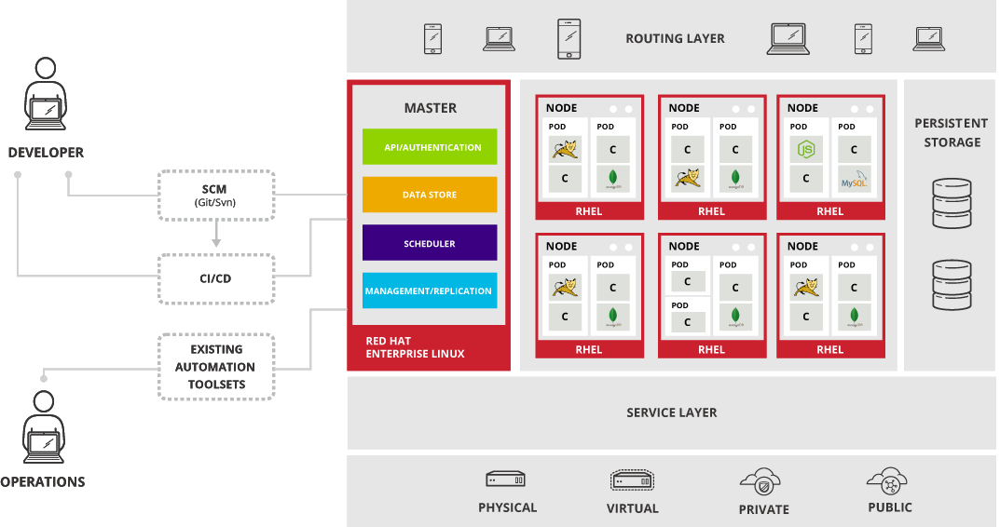

# cloud-native-guide

Cloud Native
---

Kubernetes
---
A tool used to manage or orchestrate clusters of containerized applications.

### Concepts

- **Master:** The machine that controls Kubernetes nodes. This is where all task assignments originate.

- **Node:** These machines perform the requested, assigned tasks using one or more pods. The Kubernetes master controls them.

- **Pod:** A group of one or more containers deployed to a single node. All containers in a pod share an IP address, IPC, hostname, and other resources. Pods abstract network and storage away from the underlying container. This lets you move containers around the cluster more easily.

- **Container:** A lightweight and portable executable image that contains software and all of its dependencies.
Containers decouple applications from underlying host infrastructure to make deployment easier in different cloud or OS environments, and for easier scaling.

- **Control Plane:** The container orchestration layer that exposes the API and interfaces to define, deploy, and manage the lifecycle of containers.
- **Data Plane:** The layer that provides capacity such as CPU, memory, network, and storage so that the containers can run and connect to a network.

- **Cluster:** A set of machines, called nodes, that run containerized applications managed by Kubernetes. A cluster has at least one worker node and at least one master node. The worker node(s) host the pods that are the components of the application. The master node(s) manages the worker nodes and the pods in the cluster. Multiple master nodes are used to provide a cluster with failover and high availability.

- **Replication controller:**  This controls how many identical copies of a pod should be running somewhere on the cluster.

- **Service:** This decouples work definitions from the pods. Kubernetes service proxies automatically get service requests to the right pod—no matter where it moves to in the cluster or even if it’s been replaced.

- **Kubelet:** This service runs on nodes and reads the container manifests and ensures the defined containers are started and running.

- **kube-proxy:** kube-proxy is a network proxy that runs on each node in your cluster, implementing part of the Kubernetes Service concept. kube-proxy maintains network rules on nodes. These network rules allow network communication to your Pods from network sessions inside or outside of your cluster.

- **kubectl:** This is the command line configuration tool for Kubernetes.

- **Dashboard**

#### Why Kubernetes
- Self-healing
- Automated rollouts and rollbacks
- Service discovery and load balancing
- Storage orchestration
- Secret and configuration management

#### Kubernetes Components
- When you deploy Kubernetes, you get a cluster.
- A cluster is a set of machines, called nodes, that run containerized applications managed by Kubernetes.
- A cluster has at least one worker node and at least one master node.
- The worker node(s) host the pods that are the components of the application.
- The master node(s) manages the worker nodes and the pods in the cluster.
- Multiple master nodes are used to provide a cluster with failover and high availability.

- Master Components:
    - provide the cluster's control plane
    - makes global decision for the cluster, like scheduling
    - detects and respond to cluster events

    *kube-apiserver*
        - frontend for the kubernetes control plance
        - exposes kubernetes API
    *etcd*
        - key value distributed store used as K8s backing store for all cluster data
    *kube-scheduler*
        - watches newly created pod that have no node assigned and selects the node for them to run on.
    *kube-controller-manager*
        - runs controllers
        - Controllers are control loops(non-terminating) that watches the state of your cluster, then each controller responsible for the  resource make or request changes where needed to get from current state to desire state.
        - Each controller is a separate process
        - Controllers include:
            - Node Controller: responsible for noticing and responding when nodes go down,
            - Replication controller: responsible for maintaining the correct number of pods,
            - Endpoint controller:  and Service Account & Token controller.
- Node/Worker Components:
    run on every node, maintaining running pods and providing the Kubernetes runtime environment.
    - **kubelet**
        - An agent that runs on each node in the cluster. It makes sure that containers are running in a pod.
        - watches for tasks sent from the API Server, executes the task, and reports back to the Master.
    - **kube-proxy**
        - a network proxy that runs on each node in your cluster, implementing part of the Kubernetes Service concept.
        - makes sure that each node gets its IP address, implements local iptables and rules to handle routing and traffic load-balancing.
    - **container runtime**
        - pulls images from a container image registry and starts and stops containers.
        - A 3rd party software or plugin, such as Docker, usually performs this function.
    - **Pod**
        - is the smallest element of scheduling in Kubernetes. Without it, a container cannot be part of a cluster. If you need to scale your app, you can only do so by adding or removing pods.
        - The pod serves as a ‘wrapper’ for a single container with the application code.
        - Based on the availability of resources, the Master schedules the pod on a specific node and coordinates with the container runtime to launch the container.
- Addons

- **Kuberneties Services**
    - Pods are not constant. One of the best features Kubernetes offers is that non-functioning pods get replaced by new ones automatically.
    - However, these new pods have a different set of IPs. It can lead to processing issues, and IP churn as the IPs no longer match. If left unattended, this property would make pods highly unreliable.
    - Services are introduced to provide reliable networking by bringing stable IP addresses and DNS names to the unstable world of pods.
    - By controlling traffic coming and going to the pod, a Kubernetes service provides a stable networking endpoint – a fixed IP, DNS, and port. Through a service, any pod can be added or removed without the fear that basic network information would change in any way.

### Deployment Strategies

### Networkings

## Openshift

### Concepts

### Local Deployment

### Deployment Strategies

## AWS

### Concepts

## References
* https://kubernetes.io/docs/home/
* https://phoenixnap.com/kb/understanding-kubernetes-architecture-diagrams
* interactive learning: https://learn.openshift.com/introduction
* ebook: https://assets.openshift.com/hubfs/pdfs/OpenShift_for_Developers_Red_Hat.pdf?hsLang=en-us&extIdCarryOver=true&sc_cid=701f2000001Css5AAC
* https://medium.com/google-cloud/understanding-kubernetes-networking-pods-7117dd28727#:~:targetText=0.2%2C%20whose%20default%20gateway%20is,0.1.
* https://platform9.com/wp-content/uploads/2019/04/The-Gorilla-Guide-to-Kubernetes-in-the-Enterprise.pdf
